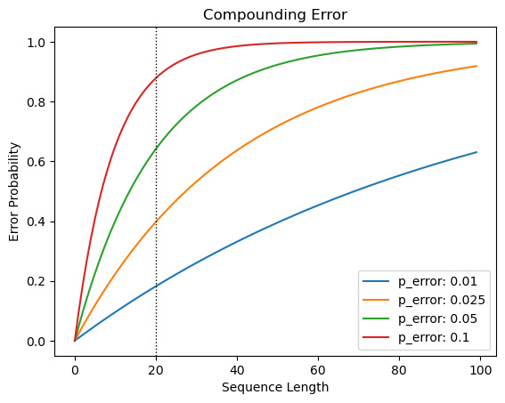

Yann LeCun believes autoregressive models inherently suffer from a kind of 'generational drift'[^1] due to compounding errors.
Coming from LeCun - Chief AI Scientist at Meta and famed for his work on convolutional neural networks and image recognition -
this alarming statement carries a lot of weight.
It is also, I think, a novel concept to people who are not steeped in statistics, or who do not understand how generative models work.
Let's explore further to understand LeCun's point, the implications to GPT-style autoregressive language models,
and the applications of said models.

LLMs like ChatGPT or Llama are (GPTs - generative pre-trained transformers); they work by generating tokens _in sequence_.
At a high level - given an input (your prompt, a global system instruction, etc.), a GPT picks token that is most likely going to come next.
It does this by understanding the relationships between the trillions of tokens-in-sequence it saw when it was trained.
After it picks (or _predicts_) the first token, it will pick the second based on the input _and the first predicted token_.

Wash, rinse, repeat 𝄇

## Problem: Compounding error

Any time you make a prediction, there is some chance you will predict correctly -- and hopefully that chance is > 50% or you're better off flipping a coin.
However, the inverse is also true; any time you make a prediction, there is some chance you will predict _incorrectly_.

Every time you make a subsequent prediction in a sequence, you increase the chance that an error has occurred _somewhere_ in that sequence.
In other words, the likelihood of an error compounds over sequential steps.
If every step has an error rate of `1%`, the probability of encountering an error after 20 steps is 18%, but after 200 steps, it has grown to 87%!



If every step has an error rate of `5%`, you have a 64% chance of encountering an error after 20 steps!


  That last sentence contained 28 tokens (using ChatGPT 4's tokenizer)!


Does that mean we get lucky every time we use ChatGPT and receive a response that's longer than a few words?



  ```py
  import matplotlib.pyplot as plt
  import tiktoken
  #%%
  def error(n: int, p_error: float=0.01):
      p_correct = (1 - p_error) ** n
      return 1-p_correct

  #%%
  probs = [0.01, 0.025, 0.05, 0.1]
  for err in probs:
      x = range(100)
      y = [error(i, err) for i in x]

      plt.plot(
          x, y,
          label=f"p_error: {err}"
      )

  plt.legend()
  plt.title("Compounding Error")
  plt.xlabel("Sequence Length")
  plt.ylabel("Error Probability")
  plt.axvline(20, linewidth=1, color='black', linestyle=':')
  plt.show()

  #%%
  encoding = tiktoken.encoding_for_model("gpt-4")
  tokens = encoding.encode(
    "If every step has an error rate of `5%`, you have a 64% chance of encountering an error after 20 steps!"
  )
  print(len(tokens))
  ```



## Rebuttal


  I've used ChatGPT, and it doesn't seem like it makes a mistake in the majority of sentences...


Astute observation!  There are a few things at play here...

### Text generation with LLMs isn't purely sequential with respect to error

LeCun's point about compounding error is valid for experiments like flipping a coin --
the more flips you perform, the higher the chance of getting tails (assuming tails is a proxy for error in our above experiment)

However, this is not strictly true with LLMs because they take into account the context - _the entire sequence of past words, including those provided in the prompt_.
In our coin flip example, it would be as if all prior flips influenced the next one.
The addition of a token to the prediction context alters the the system from which the next token is generated.
As we do not know _how much_ that specific new token alters the specific system,
all we can say with respect to the compounding error is that the limits of compounding are **at worst** the exponential case,
but may be significantly better as though each token generation is a new experiment (i.e., there is no compounding effect).

### Language is flexible

Language is a bit more flexible than a binary "right vs wrong" assessment. A sentence starting with "An apple" might have continuations:

$$
\begin{align*}
\text{An apple} & \longrightarrow \text{is a fruit} \\\\
\text{} & \longrightarrow \text{tastes delicious} \\\\
\text{} & \longrightarrow \text{a day keeps the doctor away} \\\\
\end{align*}
$$

So an LLM might pick a token that is not 'right' -- it's not what _you_ would pick, but it might be grammatically, logically, and semantically valid.
Additionally, because the LLM predicts the next token given all historic context, it is plausible that when generating
the 5th and 6th token, it starts to veer off into error but then recovers at the 8th token because of the influence of the context.  Joannes Vermorel illustrates[^2]:

> Question: Was Pierre-Simon de Laplace a great mathematician? (respond like an opinionated Frenchman)
>
> Answer A: No, absolutely not.
>
> Answer B: No, absolutely not, he was the greatest of his time!
>
> Starting the answer with _No_ is seemingly a wholly incorrect token, as demonstrated by Answer A.
> However, when this answer is extended with the second part of the sentence, it becomes the correct token, and captures the tone and structure that would be expected here.
> The validity of the token "No" cannot be assessed independently from the tokens to be later generated.

## Implications

So the concerns about autoregressive generation leading to compounding error may not be as bad as Yann LeCun's exponential accumulation theory;
exponential accumulation is the worst case scenario.

### Hallucination

The linguistic flexibility that reduced our concerns regarding compounding error is the same property that gives us
the astonishing capability of LLMs to sound "human" in their generation or be creative when answering is also a factor
(when combined with autoregressive generation) in their propensity to hallucinate.


  Previously in this article, I said:

  > a GPT picks token that is most likely going to come next.

  This is an approach known as _greedy search_.
  If ChatGPT used greedy sampling, each generation would be deterministic - that is, guaranteed to be the same - based on the prior context.
  For example, given "An apple", the model might _always_ return "is a fruit".

  This is not to say that "is", "a", "fruit" are the correct next tokens (per our discussion of error), but that these are the tokens the model believes to be most likely (or maybe _least wrong_).

  Because language is flexible and we don't want our LLMs to sound like robots, we tend to select next tokens from the probability distribution of likely next tokens instead of picking the singular most-likely token.


As one might expect, using a stochastic (random, nondeterministic sampling technique) [^3] to select the next token tends to decrease performance in all tasks except for open-ended generation. [^4]
This makes sense - models are trained to predict the best next token, and adding random noise in support of flexibility
acts in opposition to that goal.
And while future tokens might be able to readjust an error in generation, the error is set once generated and influences all future tokens that use the context.

### Compounding error in conversations, chains, agents

Hallucination, by definition, is a judgement that the complete generated response is erroneous as a whole.
It is binary test for correct vs. incorrect that is challenging to do at the token level due to the aforementioned linguistic flexibility.
So, now that we're thinking about the complete output sequence as a whole, does our concern about compounding error change?

ChatGPT, Phind, Perplexity, and the like all feature a conversation-style chat interface, where the forthcoming response
includes prior user-machine exchanges in the historic context.
If an error (hallucination, confabulation, illogic, etc.) occurred in response #2, that error is persisted through the conversation.

[LangChain](https://www.langchain.com/) is probably the best-known developer framework used for building applications based on LLMs.
One of its key features is LCEL (LangChain Expression Language), a method of templating prompts and responses so they can be
_chained_, or strung together in sequence, to accomplish some task.


  I see -- so if the LLM makes an error early in the chain, the error influence later generations?


Right!  And, if the LLM has a 1% chance of making a mistake, we're back to our problem of compounding errors.

Last one to hammer the point home --

In the world of LLM application engineering as defined by LangChain, _chains_ are described as predetermined steps
(think question/answer or instruction/completion) while _agents_ also use LLMs to reason.
In the Agent paradigm, we might not only chain steps together, but also ask the LLM to decide which steps.
Agents are worth at least another post; superficially, one common pattern is to use the LLM-as-Agent to decompose
a big problem into smaller tasks, send those subtasks through chains, and then recombine at the end to provide the result.
In order for an Agent to operate successfully, it must be able to resolve the risk of compounding error
inherent to the multiple tiers of prediction sequences (token, response, chain, agent).

Sholto Douglas (of Google Deepmind's Gemini team) said it best:[^5]

> If you can't chain tasks successively with high enough probability, then you won't get something that looks like an agent.

## For further exploration

- Why is there error at all? Consider the training data
  - Language is messy
  - Training examples may oppose each other (i.e., no 'right' answer or 'right' has changed)
    - [[2403.08319] Knowledge Conflicts for LLMs: A Survey](https://arxiv.org/abs/2403.08319)
    - [[2402.14409v1] Tug-of-War Between Knowledge: Exploring and Resolving Knowledge Conflicts in Retrieval-Augmented Language Models](https://arxiv.org/abs/2402.14409v1)
- Search and sampling techniques vs compounding sequential error

## Footnotes

[^1]: [Transcript for Yann LeCun: Meta AI, Open Source, Limits of LLMs, AGI & the Future of AI | Lex Fridman Podcast #416 - Lex Fridman](https://lexfridman.com/yann-lecun-3-transcript)
[^2]: [An opinionated review of the Yann LeCun interview with Lex Fridman](https://www.lokad.com/blog/2024/3/18/ai-interview-with-yann-lecun-and-lex-fridman/)
[^3]: [How to generate text: using different decoding methods for language generation with Transformers](https://huggingface.co/blog/how-to-generate)
[^4]: [[2402.06925v1] A Thorough Examination of Decoding Methods in the Era of LLMs](https://arxiv.org/abs/2402.06925v1)
[^5]: [Sholto Douglas & Trenton Bricken - How to Build & Understand GPT-7's Mind](https://www.dwarkeshpatel.com/p/sholto-douglas-trenton-bricken#%C2%A7transcript)
